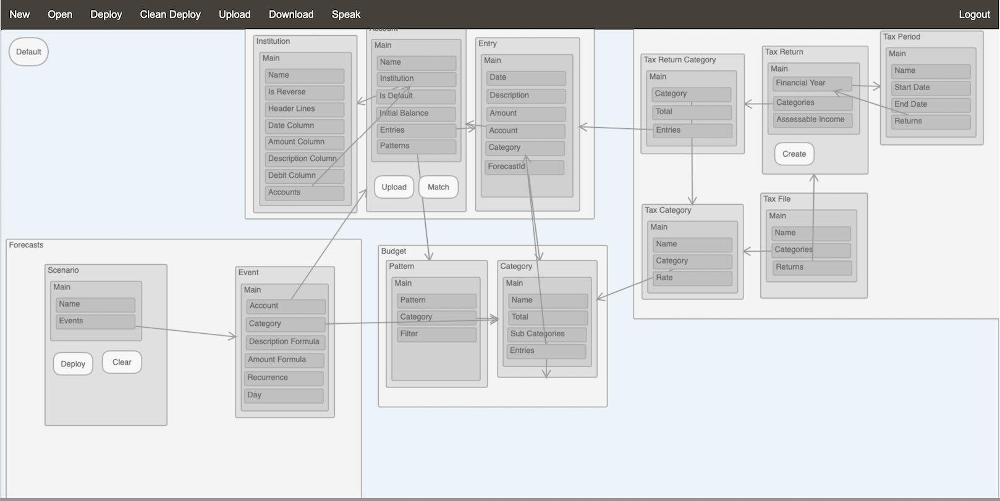

<!DOCTYPE html>
<html>
<body>

[![Contributors][contributors-shield]][contributors-url]
[![Forks][forks-shield]][forks-url]
[![Stars][stars-shield]][stars-url]
[![Issues][issues-shield]][issues-url]
[![MIT License][license-shield]][license-url]
[![LinkedIn][linkedin-shield]][linkedin-url]

 

  <h1 align="center">Model Runner - a Semantic Information Management Platform</h1>
  
  

  
ModelRunner is a complete semantic information management platform which acts as a layer of abstraction above structured database engines and allows users without any technical skills to manage the information and workflows they need via a pre-built application with a Natural Language interface. Users with technical skills can leverage the platform functionality in their own web and mobile applications via Java and REST APIs.

  
  <h1 align="center">Demos</h1>
  

This one is the latest video which showcases the voice interface: <a href="https://www.dropbox.com/s/f9v70eagurlz9tt/model%20demo%202%20-%20voice.mp4?dl=0">Voice demo</a>
 

This one is the original video which showcases a bit more of the platform, including workflows: <a href="https://www.dropbox.com/s/226iqv7os0bdxmq/Demo.mp4?dl=0">Demo</a>
  
  
Can't wait to get started? Check out the <a href="#gettingstarted">Getting Started section</a>

<h1 align="center">Platform architecture</h1>
  

The platform is made of the following components:

<ul>
<li><a href="#engine">The semantic data access engine</a></li>
<li><a href="#modeldesigner">The semantic information model designer</a></li>
<li><a href="#workflowdesigner">The workflow model designer</a></li>
<li><a href="#metaapp">The pre-built meta application</a></li>
<li><a href="#nlu">The Natural Language interface engine</a></li>
<li><a href="#javaapi">The Java API</a></li>
<li><a href="#restapi">The REST API</a></li>
</ul>  

<h2 id="engine">The semantic data access engine</h2>

  
The semantic data access engine is the core of the platform. This component interprets a semantic application model at run time and builds a hierarchy of objects representing each of the artefacts present in the model, from the top level Application object to the lower level Attribute objects. Building this object hierarchy is guided by a MetaModel XML document which describes each of the artefacts which can appear in a semantic application model. This process is achieved in 2 steps: the first step is a completely dynamic process and creates the bare objects based solely based on the metamodel document which makes extending the platform very easy. The second step is needed for any artefact which require specific processing and involves custom code which needs to be added / modified based when the meta model is updated. A typical example of the need for custom code is to initialise the references between artefacts, for example between a reference attribute and the target data type or attribute which is referenced. When the application model objects have all been initialised, the core engine is ready to create data objects or load/update data objects from/into the underlying database.

Data in the database is organised by data type who each have their own table. Each row in the data type tables have a synthetic key which is the ordinal number of the row in the table. They also have a NameSpace parent reference which is a reference to the parent data object and the id of their namespace attribute. Data references are a combination of the data type id as well as the object id, I.e., the row in the data type table. Additional tables are generated automatically for many-to-many attributes relationships.

Typical use cases for the core engine are to  access a list of data objects of the same type with or without specific selection criteria in the form of formulas which are evaluated at run time for each data object, getting a specific data object of a specific type, retrieving the value of an attribute for a specific data object. The latest can involve very complex and recursive processing depending on the type of Attribute but removes the need for application code to explicitly specify complex database queries like union, inner and outer joins, etc. The platform supports all UML relationship types including Inheritance, Composition and Aggregation. The Back Reference Attribute type is a way of traversing a relationship backwards. So if a Product data type has a Reference Attribute pointing to a Product-Type data type and Product-Type has a Back Reference Attribute pointing back to the Reference attribute in the Product data type, then the value of the Back Reference Attribute would be the list of Products pointing to this Product-Type. Attribute can also leverage Formulas which are evaluated at run time.

Action artefacts can be added to the model to add custom GUI actions or run specific formulas when data is created or updated. They are particularly useful to workflow processes when a data object is created for example.

The platform also includes an Administration model with data types which are necessary for the platform’s operation, including Applications and Users. These system data types can be accessed from any semantic application models for example to assign tasks or send notifications to users as part of workflow execution.

<h2 id="modeldesigner">The semantic information model designer</h2>

The semantic information model designer is a web interface built with pure HTML and javascript where the user can design a semantic information model by assembling artefacts including Database References, Application, Packages, Types and Attributes. Once the model is complete, it can be deployed to the database engine referenced in the default Database Reference artefact. The deployment will compare the current state of the database with the new model and only apply the required changes which means that the existing data not impacted by the changes is not affected. This deployment method enables a very agile way of building an application gradually by adding new Packages and Types at run time. A semantic Application model can include many database references at the Package (a grouping of related data type) or data type level so that each data type can potentially reside in a separate database.

When running in the latest google Chrome versions with the Google Speech Recognition API installed, the designer can be completely operated by voice and a user can build and deploy a complete application in minutes just using their voice, without requiring to type anything. This is done by implementing support for a limited domain specific language to manipulate model artefacts. The designer supports requests like “could you please create an application called test” and “insert a new type call customer and add a reference attribute called city and set the reference to city”.

<h2 id="workflowdesigner">The workflow model designer</h2>

The workflow designer is a web interface built with pure HTML and javascript where the user can design a workflow model by assembling artefacts including Steps and Actions.

Steps have pre-requisites which are formulas that must evaluate to true in order for the Step’s action to be triggered. Actions have an Object Formula which is evaluated to retrieve a data object and an Action formula to manipulate the object's data.

Workflows can be triggered for Action artefacts in a semantic application model.

<h2 id="metaapp">The pre-built meta application</h2>

The pre-built meta-application is a complete data driven web application build on Java Servlet technology which serves as an out-of-the-box presentation layer and is available for any deployed semantic application model. As soon as the model has been deployed, the meta-application is ready for end users to manage the information they need via typical data management screens which are dynamically generated at run time by the application by interpreting the semantic application model and leveraging the Java API to access the data.

The meta-application includes a navigation panel on the left side including links to all packages and data types, a button bar at the top which includes functionality like searching for a specific value in every attribute of every data object, importing and exporting list of data objects to and from csv files and back and forth navigation links.

Just like with the semantic information model designer, when running in the latest google Chrome versions with the Google Speech Recognition API installed, the meta-application can be completely operated by voice and a user can manage the information they need by just using their voice, without requiring to type anything. This is done by implementing support for a limited domain specific language to manipulate data objects and by calling the Natural Language interface engine to query data in natural language.

<h2 id="nlu">The Natural Language interface engine</h2>

The natural language interface engine analyses every word in an utterance in the context of 1) a semantic application model, 2) a default ontology of terms and 3) the data in the underlying database(s). The engine supports requests like “please get me a list of all customers aged over 50 living in Melbourne”.

<h2 id="javaapi">The Java API</h2>

The Java API exposes methods in the generic object hierarchy in the semantic data access engine. This enables Java developers who want to design custom applications to leverage the semantic data access engine in a tightly coupled architecture to speed up development processes.

<h2 id="restapi">The REST API</h2>

The REST API exposes the data in the underlying databases via simple REST requests to locate data resources based on their data type, object id, methods in the generic object hierarchy in the semantic data access engine. This enables developers who want to design custom applications to leverage the semantic data access engine in a loosely coupled architecture to speed up development processes.

<h1 id="gettingstarted" align="center">Getting Started</h1>
  

This is just the first draft so please, bear with me as I’m trying to make this as easy as possible!

<ul>
<li><a href="#database">Setting up the admin database</a></li>
<li><a href="#deploy">Deploy the platform</a></li>
</ul>  

<h2 id="database">Setting up the admin database</h2>

<h3 id="database-install">Installing the database server</h3>

  
You will need a database server with a JDBC driver, I use MySQL Community Server - GPL 8.0.19

<h3 id="database-properties">Update runtime.properties</h3>

  
Update runtime.properties to reflect your database, driver, URL etc

<h3 id="database-schema">Create admin schema</h3>

  
The default admin schema name is $$Admin but you can change that in runtime.properties. You will need to create the schema manually before continuing, I use MySQLWorkbench for this.

<h3 id="database-init">Populate system tables in the admin schema</h3>

  
You now need to populate the systems table in the Admin schema as well as publish the MetaModel and the Admin application model.

Everything related to database management and data access is in the <a href="https://github.com/etiennesillon/ModelRunner/tree/main/ModelRunner5.0/src/main/java/com/indirectionsoftware/backend/database">database package</a>. Start with <a href="https://github.com/etiennesillon/ModelRunner/blob/main/ModelRunner5.0/src/main/java/com/indirectionsoftware/backend/database/IDCDbManager.java">IDCDbManager</a> which contains the code to setup the database.

Just run the Init function specifying the properties file, the MetaModel file and the Admin application model:

Java IDCDBManager Init runtime.properties MetaModel.xml ModelAdmin.xml

BTW, this won’t do anything as I’ve commented out the code not to destroy my installation by mistake :)

FYI, the MetaModel contains the description of all artefacts that can be used in an application model, see <a href="https://github.com/etiennesillon/ModelRunner/blob/main/ModelRunner5.0/src/main/java/com/indirectionsoftware/metamodel/IDCMetaModelParser.java">IDCMetaModelParser.java</a>. The Admin application is an out of the box application to manage everything from applications to users etc. More details <a href="#engine">here</a>.

<h2 id="deploy">Deploy the platform</h2>

  
I use Eclipse IDE for Enterprise Java and Web Developers Version: 2021-12 (4.22.0) Build id: 20211202-1639

  
<a href="https://github.com/etiennesillon/ModelRunner/tree/main/ModelRunner5.0">ModelRunner5.0</a> is my complete Dynamic Web Project.

  
I use a Tomcat 7.0 server running on port 8080.

  
Once that’s done, everything should be ready to go! You can start with :

<ul>
<li>The application model editor: <a href="http://localhost:8080/ModelWebv4.0/appeditor.html">http://localhost:8080/ModelWebv4.0/appeditor.html</a></li> 
<li>Once you have deployed your app, you can start using it here: <a href="http://localhost:8080/ModelWebv4.0/">http://localhost:8080/ModelWebv4.0/</a></li> 
<li>If you want to add workflows, you can use the workflow editor: <a href="http://localhost:8080/ModelWebv4.0/workfloweditor.html">http://localhost:8080/ModelWebv4.0/workfloweditor.html</a></li>
</ul>  

  
Have fun and please give me some feedback in the <a href="https://github.com/etiennesillon/ModelRunner/discussions">Discussions</a> section!

</body>
</html>

[contributors-shield]: https://img.shields.io/github/contributors/EtienneSillon/ModelRunner?style=for-the-badge
[contributors-url]: https://github.com/etiennesillon/ModelRunner/graphs/contributors

[stars-shield]: https://img.shields.io/github/stars/etiennesillon/modelrunner?style=for-the-badge
[stars-url]: https://github.com/etiennesillon/ModelRunner/network/stargazers

[forks-shield]: https://img.shields.io/github/forks/etiennesillon/modelrunner?style=for-the-badge
[forks-url]: https://github.com/etiennesillon/ModelRunner/network/members

[issues-shield]: https://img.shields.io/github/issues/etiennesillon/ModelRunner?style=for-the-badge
[issues-url]: https://github.com/etiennesillon/ModelRunner/issues

[license-shield]: https://img.shields.io/github/license/etiennesillon/ModelRunner?style=for-the-badge
[license-url]: https://github.com/etiennesillon/ModelRunner/blob/main/ModelRunner5.0/LICENSE.txt

[linkedin-shield]: https://img.shields.io/badge/-LinkedIn-black.svg?logo=linkedin&style=for-the-badge
[linkedin-url]: https://www.linkedin.com/in/etienne-sillon-4090aa6/

[product-screenshot]: images/screenshot.png
