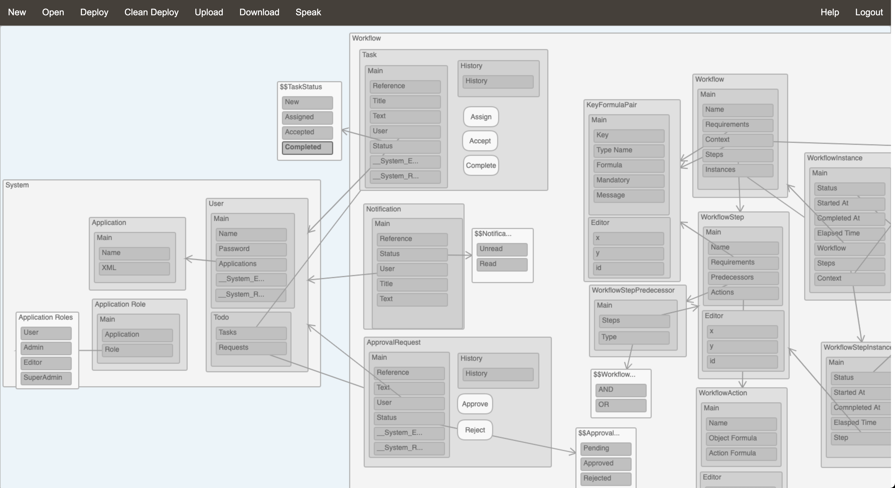

<!DOCTYPE html>
<html>
<body>

[![Contributors][contributors-shield]][contributors-url]
[![Forks][forks-shield]][forks-url]
[![Stars][stars-shield]][stars-url]
[![Issues][issues-shield]][issues-url]
[![MIT License][license-shield]][license-url]
[![LinkedIn][linkedin-shield]][linkedin-url]

 

  <h1 align="center">Model Runner</h1>
  <h1 align="center">Data Management Platform</h1>  

  

  
ModelRunner is a complete data management platform which acts as a semantic layer above structured databases and allows users to design and manage the information and workflows they need, regardless of their technical skills, by using an out-of-the-box meta-application including a Natural Language voice interface. Developers can leverage the platform functionality in their own web and mobile applications via Java and REST APIs.

  
  <h1 align="center">Demos</h1>
  

Here is a short introduction video showcasing the voice interface: <a href="https://www.youtube.com/watch?v=LH3EIRg-sfU">Voice Demo</a>

This is a longer demo introducing more aspects of the platform including formulas, actions and workflows: <a href="https://www.youtube.com/watch?v=AZqlKN2i9eM">Demo</a>
  

Can't wait to get started? Check out the <a href="#gettingstarted">Getting Started section</a>

<h1 align="center">Platform architecture</h1>
  

The platform is made of the following components:

<ul>
<li><a href="#engine">The data access engine</a></li>
<li><a href="#modeldesigner">The information model designer</a></li>
<li><a href="#workflowdesigner">The workflow model designer</a></li>
<li><a href="#metaapp">The meta application</a></li>
<li><a href="#nlu">The Natural Language interface engine</a></li>
<li><a href="#javaapi">The Java API</a></li>
<li><a href="#restapi">The REST API</a></li>
</ul>  

<h2 id="engine">The data access engine</h2>

  
The data access engine is the core of the platform. This component interprets an information model at run time and builds a hierarchy of objects representing each of the artefacts present in the model, from the top level Application object to the lower level Attribute objects. Building this object hierarchy is guided by a <a href="https://github.com/etiennesillon/ModelRunner/blob/main/Config/MetaModel.xml">MetaModel XML document</a> which describes each of the artefacts which can appear in the information model. This process is achieved in 2 steps: the first step is a completely dynamic process and creates the bare objects based solely on the metamodel document which makes extending the platform very easy. The second step is needed for any artefact which require specific processing and involves custom code which might need to be added / modified when the meta model is updated. A typical example of the need for custom code is to initialise the references between artefacts, for example between a reference attribute and a target data type. When the information model objects have all been initialised, the core engine is ready to create data objects or load/update data objects from/into the underlying database.

  
Data in the database is organised by data type who each have their own table. Each row in the data type tables has a synthetic key which is the ordinal number of the row in the table. They also have a NameSpace parent reference which is a reference to the parent data object and the id of their namespace attribute. Data references are a combination of the data type id as well as the object id, i.e., the row in the data type table. Additional tables are generated automatically for many-to-many relationships.

Typical use cases for the core engine include:

<ul>
<li>getting a specific data object of a specific type,</li>
<li>access a list of data objects of the same type with or without specific selection criteria in the form of formulas which are evaluated at run time for each data object, </li>
<li>retrieving the value of an attribute for a specific data object. This can involve very complex and recursive processing depending on the type of attribute but removes the need for application code to explicitly specify complex database queries like union, inner and outer joins, etc.</li>
</ul>

The platform supports all UML relationship types including:

<ul>
<li>Inheritance</li>
<li>Composition</li>
<li>Aggregation</li>
</ul>

The Back Reference Attribute type is a way of traversing a relationship backwards: if a Product data type has a Reference attribute called Type pointing to a Product-Type data type and if Product-Type has a Back Reference attribute called Products pointing back to the Type attribute, then the value of the Products attribute would be the list of Products pointing to this Product-Type. Attribute can also leverage Formulas which are evaluated at run time.

Action artefacts can be added to the model to add custom GUI actions or run specific formulas when data is created or updated. They are particularly useful to kickoff a workflow process when a data object is created for example.

The platform also includes an Administration information model with data types which are necessary for the platform’s operation, including Applications and Users. These system data types can be referenced from any information models to assign tasks or send notifications to users as part of workflow execution for example.

<h2 id="modeldesigner">The information model designer</h2>

The information model designer is a web interface built with pure HTML and javascript where the user can design an information model by assembling artefacts including Database References, Application (a collection of Packages), Packages  (collections of Types), Types (an Entity / data type), Attributes and Actions (event triggers either in the GUI (button) or upon create/update/delete of a data object).

Once the model is complete, it can be deployed to the database engine referenced in the default Database Reference artefact. The deployment process will compare the current state with the new model and only apply the required changes to the database. Therefore existing data which is not impacted by the changes is not affected. This deployment method enables a very agile way of building an application gradually by adding new Packages and Types at run time for example. An information model can include multiple database references specified at the Package or Type level so that each data type can potentially reside in a separate database.

When running on Google Chrome with the Google Speech Recognition API, the designer can be completely operated by voice and a user can build and deploy a complete application just using their voice, without requiring to type anything. This is done by implementing support for a limited domain specific language to manipulate model artefacts. The designer supports requests like “could you please create an application called test” and “insert a new type call customer and add a reference attribute called city and set the reference to city”. See <a href="https://www.youtube.com/watch?v=LH3EIRg-sfU">Voice Demo</a>

<h2 id="workflowdesigner">The workflow model designer</h2>

The workflow model designer is a web interface built with pure HTML and javascript where the user can design a workflow model by assembling artefacts including Steps and Actions.

Steps have pre-requisites which are formulas that must evaluate to true in order for the Step’s action to be triggered. Actions have an Object Formula which is evaluated to retrieve a data object and an Action formula to manipulate the object's data.

Workflows can be triggered for Action artefacts in an information model.

<h2 id="metaapp">The meta application</h2>

The meta-application is a complete data driven web application build on Java Servlet technology which serves as an out-of-the-box presentation layer and works with any deployed information model. As soon as the model has been deployed, the meta-application is ready for end users to manage the data they need via typical data management screens which are dynamically generated at run time by interpreting the information model and leveraging the Java API to access the data.

The meta-application includes a navigation panel on the left side including links to all Packages and Types, a button bar at the top which includes functionality like searching for a specific value in every attribute of every data object, importing and exporting list of data objects to and from csv files and back and forth navigation links.

Just like with the information model designer, when running in Google Chrome with the Google Speech Recognition API, the meta-application can be completely operated by voice and a user can manage the information they need without requiring to type anything. This is done by implementing support for a limited domain specific language to manipulate data objects and by calling the Natural Language interface engine to query data in natural language.

<h2 id="nlu">The Natural Language interface engine</h2>

The natural language interface engine analyses every word in an utterance in the context of 1) an ontology built from the semantics in an information model and <a href="https://github.com/etiennesillon/ModelRunner/blob/main/Config/IDCGlobalLexicon.txt">a simple lexicon</a> and 2) the data in the underlying database(s). The engine supports requests like “please get me a list of all customers aged over 50 living in Melbourne”.

<h2 id="javaapi">The Java API</h2>

The Java API exposes methods in the generic object hierarchy in the data access engine. This enables Java developers who want to design custom applications to leverage the data access engine in a tightly coupled architecture to speed up development processes.

<h2 id="restapi">The REST API</h2>

The REST API exposes the data in the underlying databases via simple REST requests to retreive and update data objects. This enables developers who want to design custom applications to leverage the data access engine in a loosely coupled architecture to speed up development processes.

<h1 id="gettingstarted" align="center">Getting Started</h1>
  

This is just the first draft so please, bear with me as I’m trying to make this as easy as possible!

<ul>
<li><a href="#database">Setting up the admin databases</a></li>
<li><a href="#deploy">Deploy the platform</a></li>
</ul>  

<h2 id="database">Setting up the admin databases</h2>

<h3 id="database-overview">Overview</h3>

  
There are 2 administration databases to setup:
  <ul>
    <li>The main one is the Admin database which manages the users and their applications. It is defined in <a href="https://github.com/etiennesillon/ModelRunner/blob/main/Config/AdminRuntime.properties">this properties file</a> and comes with it's own application described in <a href="https://github.com/etiennesillon/ModelRunner/blob/main/Config/ModelAdmin.xml">this model</a>.</li>
    <li>The SuperAdmin database is less important as it just manages registrations from <a href="https://modelrunner.org">modelrunner.org</a>. It is defined in <a href="https://github.com/etiennesillon/ModelRunner/blob/main/Config/SuperAdminRuntime.properties">this properties file</a> and comes with a very simple application described in <a href="https://github.com/etiennesillon/ModelRunner/blob/main/Config/SuperAdmin.xml">this model</a>.</li>
  </ul>  

<h3 id="database-install">Installing the database server</h3>

  
You will need a database server with a JDBC driver, I use MySQL Community Server - GPL 8.0.19

<h3 id="database-properties">Update runtime properties</h3>

  
Update the properties files mentioned above to reflect your database, driver, URL etc.

<h3 id="database-schema">Create the admin schemas</h3>

  
You will need to create both admin schemas manually. Their names are defined in the runtime properties files mentioned above.

<h3 id="database-init">Populate the system tables</h3>

  
Both databases can be setup by <a href="https://github.com/etiennesillon/ModelRunner/blob/main/src/main/java/com/indirectionsoftware/backend/database/IDCDbUtils.java">this class</a> with these parameters: "config Setup [db root user] [db root password] [new admin user] [new admin password]"

Everything related to database management and data access is in the <a href="https://github.com/etiennesillon/ModelRunner/tree/main/src/main/java/com/indirectionsoftware/backend/database">database package</a>. Start with <a href="https://github.com/etiennesillon/ModelRunner/blob/main/src/main/java/com/indirectionsoftware/backend/database/IDCDbUtils.java">IDCDbUtils</a> which sets up the database.

FYI, the <a href="https://github.com/etiennesillon/ModelRunner/blob/main/Config/MetaModel.xml">MetaModel</a> contains the description of all artefacts that can be used in an application model, see <a href="https://github.com/etiennesillon/ModelRunner/blob/main/src/main/java/com/indirectionsoftware/metamodel/IDCMetaModelParser.java">IDCMetaModelParser.java</a>. More details <a href="#engine">here</a>.

<h2 id="deploy">Deploy the platform</h2>

  
I use Eclipse IDE for Enterprise Java and Web Developers Version: 2021-12 (4.22.0) Build id: 20211202-1639

  
<a href="https://github.com/etiennesillon/ModelRunner">ModelRunner</a> is my complete Dynamic Web Project.

  
I use Tomcat 9.00.

  
I think that's it! Once that’s done, everything should be ready to go! Just watch the demo videos on <a href="https://modelrunner.org">modelrunner.org</a> to get you started.

  
Have fun and please give me some feedback in the <a href="https://github.com/etiennesillon/ModelRunner/discussions">Discussions section</a> or on <a href="https://modelrunner.org">modelrunner.org</a>.

And thanks for reading this :)

</body>
</html>

[contributors-shield]: https://img.shields.io/github/contributors/EtienneSillon/ModelRunner?style=for-the-badge
[contributors-url]: https://github.com/etiennesillon/ModelRunner/graphs/contributors

[stars-shield]: https://img.shields.io/github/stars/etiennesillon/modelrunner?style=for-the-badge
[stars-url]: https://github.com/etiennesillon/ModelRunner/network/stargazers

[forks-shield]: https://img.shields.io/github/forks/etiennesillon/modelrunner?style=for-the-badge
[forks-url]: https://github.com/etiennesillon/ModelRunner/network/members

[issues-shield]: https://img.shields.io/github/issues/etiennesillon/ModelRunner?style=for-the-badge
[issues-url]: https://github.com/etiennesillon/ModelRunner/issues

[license-shield]: https://img.shields.io/github/license/etiennesillon/ModelRunner?style=for-the-badge
[license-url]: https://github.com/etiennesillon/ModelRunner/blob/main/ModelRunner5.0/LICENSE.txt

[linkedin-shield]: https://img.shields.io/badge/-LinkedIn-black.svg?logo=linkedin&style=for-the-badge
[linkedin-url]: https://www.linkedin.com/in/etienne-sillon-4090aa6/

[product-screenshot]: images/screenshot.png
